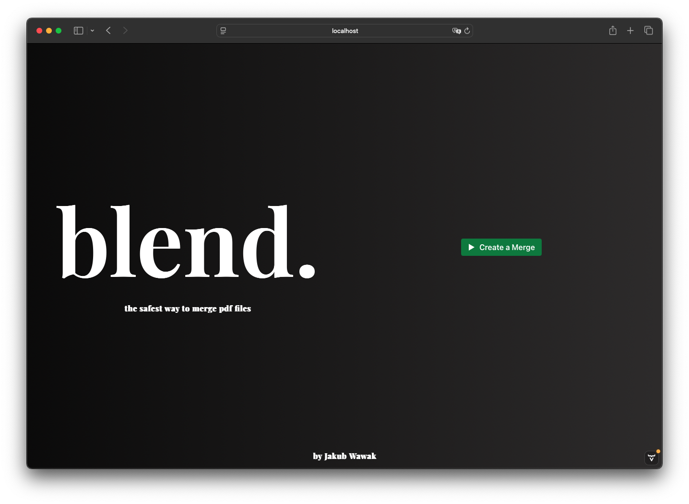

# pdf**blend**



## Overview

**Fully local pdf merging application**

PdfBlend is a powerful application designed to merge PDF files seamlessly. It provides a user-friendly interface and robust functionality to handle various PDF merging tasks efficiently. Application is open-source and free to use.

## Features
- **Merge Multiple PDFs**: Combine multiple PDF files into a single document.
- **Drag and Drop Support**: Easily add files to the merge queue using drag and drop.
- **Customizable Output**: Choose the order of the files and set output options.
- **Cross-Platform Compatibility**: Works on Windows, macOS, and Linux.

## Technology Stack
- **Java**: The core application is built using Java.
- **Tomcat**: For serving the application.
- **Vaadin**: For the graphical user interface.
- **Maven**: For project management and dependency management.
- **CSS**: For styling the application interface.
- **PDFBox**: For handling PDF file operations.

## Deployment Instructions
To deploy the PdfBlend application, follow these steps:

1. **Clone the Repository**:
   ```bash
   git clone https://github.com/yourusername/pdfblend.git
   cd pdfblend
   ```

2. **Build the Project**:
   Ensure you have Maven installed, then run:
   ```bash
   mvn clean install
   ```

3. **Run the Application**:
   After building, navigate to the target directory and run:
   ```bash
   java -jar target/pdfblend-1.0.jar
   ```

4. **Access the Application**:
   Open your web browser and go to `http://localhost:9000` to access the application.

Or simply download the latest release from [here](https://github.com/jakubwawak/pdfblend/releases/latest) and run the executable file with command `java -jar pdfblend.jar`

## Contributing
Contributions are welcome! Please submit a pull request or open an issue for any enhancements or bug fixes.

## License
This project is licensed under the MIT License - see the [LICENSE](LICENSE) file for details.
